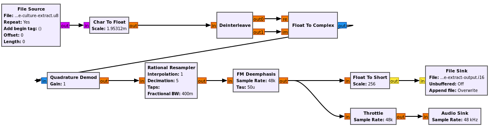
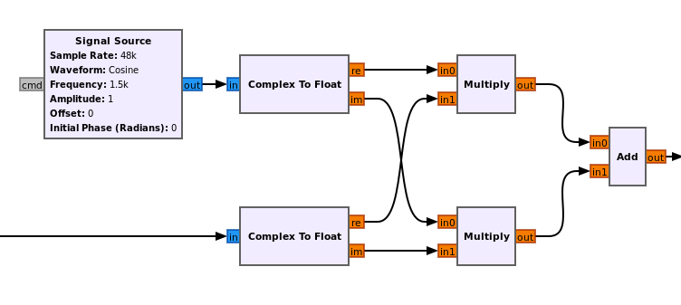

# fsdr-cli

A command line interface based on [FutureSDR](http://www.futuresdr.org) meant to be

* a line-for-line replacement of [csdr](https://github.com/jketterl/csdr) ([original](https://github.com/ha7ilm/csdr)),
* yet able to pack pipelined command in one unique-flowgraph,
* with new commands and expression evaluation,
* able to launch simple GNU Radio Companion flowgraph within FutureSDR runtime,
* a testing tool for [FutureSDR community blocks](https://github.com/FutureSDR/fsdr-blocks)

Features:

* csdr retrocompatibility: ongoing
* GNU Radio flowgraph execution: ongoing
* all in one flow graph execution: single process, no more pipes!
* expression evaluation
* conversion of csdr commands into GNU Radio companion flowgraph wherever possible
* additional commands

## WFM decoding

In the [csdr documentation about WFM demodulation](https://github.com/jketterl/csdr#demodulate-wfm), one can find the following command line:

```bash
rtl_sdr -s 240000 -f 89500000 -g 20 - | csdr convert_u8_f | csdr fmdemod_quadri_cf | csdr fractional_decimator_ff 5 | csdr deemphasis_wfm_ff 48000 50e-6 | csdr convert_f_s16 | mplayer -cache 1024 -quiet -rawaudio samplesize=2:channels=1:rate=48000 -demuxer rawaudio -
```

Does it works with `fsdr-cli`? For sure! Just replace every `csdr` with `fsdr-cli`:

```bash
rtl_sdr -s 240000 -f 89500000 -g 20 - | fsdr-cli convert_u8_f | fsdr-cli fmdemod_quadri_cf | fsdr-cli fractional_decimator_ff 5 | fsdr-cli deemphasis_wfm_ff 48000 50e-6 | fsdr-cli convert_f_s16 | mplayer -cache 1024 -quiet -rawaudio samplesize=2:channels=1:rate=48000 -demuxer rawaudio -
```

But is it the most efficient way? No. One can benefit from FutureSDR efficient scheduling. You just need to transform it as such:

```bash
rtl_sdr -s 240000 -f 89500000 -g 20 - | fsdr-cli csdr convert_u8_f ! convert_ff_c ! fmdemod_quadri_cf ! fractional_decimator_ff 5 ! deemphasis_wfm_ff 48000 50e-6 ! convert_f_s16 | mplayer -cache 1024 -quiet -rawaudio samplesize=2:channels=1:rate=48000 -demuxer rawaudio -
```

Bascially, it is just a matter of replacing pipe `|` with `!` (escaping pipeline `\|` is also working) so that your shell does not interpret them, and asking `fsdr-cli` to interpret the command line as a multi-block of `csdr` command. There is also one newly inserted block `convert_ff_c` due to otherwise ill-typed workflow.

And by the way, why use `mplayer` for sound output? There is also an [`audio` command](#audio):

```bash
rtl_sdr -s 240000 -f 89500000 -g 20 - | fsdr-cli csdr convert_u8_f ! convert_ff_c ! fmdemod_quadri_cf ! fractional_decimator_ff 5 ! deemphasis_wfm_ff 48000 50e-6 ! audio "48_000" 1
```

But maybe you are more used to [GNURadio](https://www.gnuradio.org/) and would have come with the following workflow [chain1.grc](tests/chain1.grc):


Well, it also works:

```bash
fsdr-cli grc tests/chain1.grc
```

All would run fine (even keeping the blocks' name):

```
$ ./target/release/fsdr-cli grc tests/chain1.grc 
$ ./target/debug/fsdr-cli grc tests/chain1.grc 
FutureSDR: DEBUG - in run_flowgraph
FutureSDR: DEBUG - Listening on 127.0.0.1:1337
FutureSDR: DEBUG - connect stream io
FutureSDR: DEBUG - connect message io
FutureSDR: DEBUG - init blocks
FutureSDR: DEBUG - wait for blocks init
FutureSDR: DEBUG - running blocks
FutureSDR: DEBUG - blocks_file_source_0 terminating 
FutureSDR: DEBUG - blocks_char_to_float_0 terminating 
FutureSDR: DEBUG - blocks_deinterleave_0 terminating 
FutureSDR: DEBUG - blocks_float_to_complex_0 terminating 
FutureSDR: DEBUG - analog_quadrature_demod_cf_0 terminating 
FutureSDR: DEBUG - rational_resampler_xxx_0 terminating 
FutureSDR: DEBUG - analog_fm_deemph_0 terminating 
FutureSDR: DEBUG - blocks_float_to_short_0 terminating 
FutureSDR: DEBUG - blocks_file_sink_0 terminating 
FutureSDR: DEBUG - blocks_throttle_0 terminating 
FutureSDR: DEBUG - audio_sink_0 terminating
```

## NFM Decoding

```bash
fsdr-cli csdr load_c tests/test-nfm.c32 ! fir_decimate_cc 10 0.005 HAMMING ! fmdemod_quadri_cf ! limit_ff ! deemphasis_nfm_ff 48000 ! agc_ff ! audio 48000 1
```

## AM Decoding

```bash
fsdr-cli csdr load_u8 tests/test-am.u8 ! convert_u8_f ! convert_ff_c ! shift_addition_cc "((145M-144M400)/2_400_000)" ! fir_decimate_cc 16 0.005 HAMMING ! amdemod_cf ! fastdcblock_ff ! agc_ff ! limit_ff ! audio "48_000" 1
```

Oh by the way, did you notice that you no longer need python? Look at the `shift_addition_cc` parameter.
Everywhere one can provide a value can also now provide an expression given it is in bracket "()". Due to bash rules, you may be required to surround them with quotes. You can also use constants `pi`, `e`, `nan`, `inf`, `neg_inf`, `tau` wherever appropriate.

One can also use multipliers notation like `145M500` would be interpreted as `145500000`. Valid multipliers are `K`, `M`, and `G`. Also `_` can be used as a separator to ease lisibility, eg `145_500_000`.

## SSB decoding

Just like with `csdr`, one can simulate analog circuit with following commands to demodulate LSB:

```bash
fsdr-cli csdr load_c tests/ssb_lsb_256k_complex2.dat ! shift_addition_cc "(-51500/256000)" ! fir_decimate_cc "(256000/48000)" 0.005 HAMMING ! bandpass_fir_fft_cc -0.1 0.0 0.05 ! realpart_cf ! agc_ff ! limit_ff ! audio 48_000 1
```

Reminder:

* `bandpass_fir_fft_cc 0 0.1` for USB
* `bandpass_fir_fft_cc -0.1 0` for LSB

Yet, thanks to newly added `weaver_lsb_cf` and `weaver_usb_cf` we may have better result with following commands line:

```bash
fsdr-cli csdr load_c tests/ssb_lsb_256k_complex2.dat ! shift_addition_cc "(-51500/256000)" ! rational_resampler_cc 48000 256000 ! weaver_usb_cf "(1500/48000)" ! gain_ff 0.00000008 ! limit_ff ! audio 48_000 1
```

## IQEngine plugins

```bash
fsdr-cli csdr \
shift_addition_cc (-22850/100000) ! \
fmdemod_quadri_cf ! \
rational_resampler_ff 12 25 ! \
dsc_fc ! \
timing_recovery_cc GARDNER 20 0.5 2 ! \
realpart_cf ! \
binary_slicer_f_u8 ! \
pattern_search_u8_u8 1920 1 0 1 1 1 0 1 1 1 1 1 1 0 0 1 0 0 1 1 0 0 0 0 0 1 0 0 1 1 1 ! \
pack_bits_8to1_u8_u8 ! \
dump_u8
```

```
csdr shift_addition_cc (-22850/100000)
```

```
csdr shift_addition_cc (-22850/100000) ! fmdemod_quadri_cf ! dsb_fc
```

```
csdr shift_addition_cc (-22850/100000) ! fmdemod_quadri_cf ! rational_resampler_ff 12 25 ! dsb_fc
```

```
csdr shift_addition_cc (-22850/100000) ! fmdemod_quadri_cf ! rational_resampler_ff 12 25 ! dsb_fc ! timing_recovery_cc GARDNER 20 0.5 2
```

```
csdr shift_addition_cc (-22850/100000) ! fmdemod_quadri_cf ! rational_resampler_ff 12 25 ! dsb_fc ! timing_recovery_cc GARDNER 20 0.5 2 ! realpart_cf ! binary_slicer_f_u8 ! pattern_search_u8_u8 1920 1 0 1 1 1 0 1 1 1 1 1 1 0 0 1 0 0 1 1 0 0 0 0 0 1 0 0 1 1 1 ! pack_bits_8to1_u8_u8
```

## TODO

So much more to experiment with! [Just come to help](CONTRIBUTING.md). ;-

## commands

### [audio](#audio)

Syntax:

```bash
audio rate num_inputs
audio "48_000" 1
```

Create a sink from an audio device. The sink has `num_inputs` floating streams as inputs.

Not all audio rate will be supported by your device, nor `num_inputs`.
`fsdr-cli` will try his best to find a compatible one but better for you to adapt the flowgraph.

### [load_XX](#load_xx)

Syntax:

```bash
load_u8 filename
load_f filename
load_c filename
```

Use the file as input.

### [rational_resampler_cc](#rational_resampler_cc)

Syntax:

```bash
rational_resampler_cc interp decim
```

Resample stream based on rational ratio: `interp/decim`, just like [rational_resampler_ff](https://github.com/jketterl/csdr#rational_resampler_ff) but on complex stream.

### [weaver_XXX_cf](#weaver_xxx_cf)

Syntax:

```bash
weaver_usb_cf mid_audio_freq_rate
weaver_lsb_cf mid_audio_freq_rate

weaver_usb_cf "(1500/48000)"
```

Apply weaver method for SSB decoding. Usually one take 1500Hz as the center of the audible audio bandwidth. Basically it acts as following flowgraph:



### [csdr retrocompatibility commands](#csdr-retrocompatibility-commands)

- [x] [realpart_cf](https://github.com/jketterl/csdr#realpart_cf)[^4]
- [x] [clipdetect_ff](https://github.com/jketterl/csdr#clipdetect_ff)
- [x] [limit_ff](https://github.com/jketterl/csdr#limit_ff)[^2][^3][^4]
- [x] [gain_ff](https://github.com/jketterl/csdr#gain_ff)
- [ ] [clone](https://github.com/jketterl/csdr#clone)
- [ ] [through](https://github.com/jketterl/csdr#through)
- [ ] [none](https://github.com/jketterl/csdr#none)
- [ ] [yes_f](https://github.com/jketterl/csdr#yes_f)
- [ ] [detect_nan_ff](https://github.com/jketterl/csdr#detect_nan_ff)
- [x] [dump_f](https://github.com/jketterl/csdr#dump_f)
- [x] [dump_u8](https://github.com/jketterl/csdr#dump_u8)
- [ ] [flowcontrol](https://github.com/jketterl/csdr#flowcontrol)
- [ ] [shift_math_cc](https://github.com/jketterl/csdr#shift_math_cc)
- [x] [shift_addition_cc](https://github.com/jketterl/csdr#shift_addition_cc)[^2][^3][^4]
- [ ] [shift_addition_cc_test](https://github.com/jketterl/csdr#shift_addition_cc_test)
- [ ] [shift_table_cc](https://github.com/jketterl/csdr#shift_table_cc)
- [ ] [shift_addfast_cc](https://github.com/jketterl/csdr#shift_addfast_cc)
- [ ] [shift_unroll_cc](https://github.com/jketterl/csdr#shift_unroll_cc)
- [ ] [decimating_shift_addition_cc](https://github.com/jketterl/csdr#decimating_shift_addition_cc)
- [ ] [shift_addition_fc](https://github.com/jketterl/csdr#shift_addition_fc)
- [ ] [dcblock_ff](https://github.com/jketterl/csdr#dcblock_ff)
- [x] [fastdcblock_ff](https://github.com/jketterl/csdr#fastdcblock_ff)[^3]
- [x] [fmdemod_atan_cf](https://github.com/jketterl/csdr#fmdemod_atan_cf)
- [x] [fmdemod_quadri_cf](https://github.com/jketterl/csdr#fmdemod_quadri_cf)[^1]
- [ ] [fmdemod_quadri_novect_cf](https://github.com/jketterl/csdr#fmdemod_quadri_novect_cf)
- [x] [deemphasis_wfm_ff](https://github.com/jketterl/csdr#deemphasis_wfm_ff)[^1]
- [x] [deemphasis_nfm_ff](https://github.com/jketterl/csdr#deemphasis_nfm_ff)[^2]
- [x] [amdemod_cf](https://github.com/jketterl/csdr#amdemod_cf)[^3]
- [ ] [amdemod_estimator_cf](https://github.com/jketterl/csdr#amdemod_estimator_cf)
- [ ] [firdes_lowpass_f](https://github.com/jketterl/csdr#firdes_lowpass_f)
- [ ] [firdes_bandpass_c](https://github.com/jketterl/csdr#firdes_bandpass_c)
- [x] [fir_decimate_cc](https://github.com/jketterl/csdr#fir_decimate_cc)[^2][^3][^4]
- [ ] [fir_interpolate_cc](https://github.com/jketterl/csdr#fir_interpolate_cc)
- [x] [rational_resampler_ff](https://github.com/jketterl/csdr#rational_resampler_ff)
- [x] [fractional_decimator_ff](https://github.com/jketterl/csdr#fractional_decimator_ff)[^1]
- [ ] [old_fractional_decimator_ff](https://github.com/jketterl/csdr#old_fractional_decimator_ff)
- [x] [bandpass_fir_fft_cc](https://github.com/jketterl/csdr#bandpass_fir_fft_cc)[^4]
- [x] [agc_ff](https://github.com/jketterl/csdr#agc_ff)[^3][^4]
- [ ] [fastagc_ff](https://github.com/jketterl/csdr#fastagc_ff)[^2]
- [ ] [fft_cc](https://github.com/jketterl/csdr#fft_cc)
- [ ] [fft_fc](https://github.com/jketterl/csdr#fft_fc)
- [ ] [fft_benchmark](https://github.com/jketterl/csdr#fft_benchmark)
- [ ] [logpower_cf](https://github.com/jketterl/csdr#logpower_cf)
- [ ] [encode_ima_adpcm_i16_u8](https://github.com/jketterl/csdr#encode_ima_adpcm_i16_u8)
- [ ] [decode_ima_adpcm_u8_i16](https://github.com/jketterl/csdr#decode_ima_adpcm_u8_i16)
- [ ] [compress_fft_adpcm_f_u8](https://github.com/jketterl/csdr#compress_fft_adpcm_f_u8)
- [ ] [fft_exchange_sides_ff](https://github.com/jketterl/csdr#fft_exchange_sides_ff)
- [x] [dsb_fc](https://github.com/jketterl/csdr#dsb_fc)
- [ ] [add_dcoffset_cc](https://github.com/jketterl/csdr#add_dcoffset_cc)
- [ ] [convert_f_samplerf](https://github.com/jketterl/csdr#convert_f_samplerf)
- [ ] [fmmod_fc](https://github.com/jketterl/csdr#fmmod_fc)
- [ ] [fixed_amplitude_cc](https://github.com/jketterl/csdr#fixed_amplitude_cc)
- [ ] [mono2stereo_s16](https://github.com/jketterl/csdr#mono2stereo_s16)
- [ ] [setbuf](https://github.com/jketterl/csdr#setbuf)
- [ ] [fifo](https://github.com/jketterl/csdr#fifo)
- [ ] [psk31_varicode_encoder_u8_u8](https://github.com/jketterl/csdr#psk31_varicode_encoder_u8_u8)
- [ ] [repeat_u8](https://github.com/jketterl/csdr#repeat_u8)
- [ ] [uniform_noise_f](https://github.com/jketterl/csdr#uniform_noise_f)
- [ ] [gaussian_noise_c](https://github.com/jketterl/csdr#gaussian_noise_c)
- [x] [pack_bits_8to1_u8_u8](https://github.com/jketterl/csdr#pack_bits_8to1_u8_u8)
- [ ] [pack_bits_1to8_u8_u8](https://github.com/jketterl/csdr#pack_bits_1to8_u8_u8)
- [ ] [awgn_cc](https://github.com/jketterl/csdr#awgn_cc)
- [ ] [add_n_zero_samples_at_beginning_f](https://github.com/jketterl/csdr#add_n_zero_samples_at_beginning_f)
- [ ] [fft_one_side_ff](https://github.com/jketterl/csdr#fft_one_side_ff)
- [ ] [logaveragepower_cf](https://github.com/jketterl/csdr#logaveragepower_cf)
- [ ] [mono2stereo_s16](https://github.com/jketterl/csdr#mono2stereo_s16)
- [ ] [psk31_varicode_decoder_u8_u8](https://github.com/jketterl/csdr#psk31_varicode_decoder_u8_u8)
- [ ] [_fft2octave](https://github.com/jketterl/csdr#_fft2octave)
- [ ] [invert_u8_u8](https://github.com/jketterl/csdr#invert_u8_u8)
- [ ] [rtty_baudot2ascii_u8_u8](https://github.com/jketterl/csdr#rtty_baudot2ascii_u8_u8)
- [x] [binary_slicer_f_u8](https://github.com/jketterl/csdr#binary_slicer_f_u8)
- [ ] [serial_line_decoder_f_u8](https://github.com/jketterl/csdr#serial_line_decoder_f_u8)
- [ ] [pll_cc](https://github.com/jketterl/csdr#pll_cc)
- [x] [timing_recovery_cc](https://github.com/jketterl/csdr#timing_recovery_cc)
- [x] [octave_complex_c](https://github.com/jketterl/csdr#octave_complex_c)
- [ ] [psk_modulator_u8_c](https://github.com/jketterl/csdr#psk_modulator_u8_c)
- [ ] [duplicate_samples_ntimes_u8_u8](https://github.com/jketterl/csdr#duplicate_samples_ntimes_u8_u8)
- [ ] [psk31_interpolate_sine_cc](https://github.com/jketterl/csdr#psk31_interpolate_sine_cc)
- [ ] [differential_encoder_u8_u8](https://github.com/jketterl/csdr#differential_encoder_u8_u8)
- [ ] [differential_decoder_u8_u8](https://github.com/jketterl/csdr#differential_decoder_u8_u8)
- [ ] [bpsk_costas_loop_cc](https://github.com/jketterl/csdr#bpsk_costas_loop_cc)
- [ ] [simple_agc_cc](https://github.com/jketterl/csdr#simple_agc_cc)
- [ ] [peaks_fir_cc](https://github.com/jketterl/csdr#peaks_fir_cc)
- [ ] [firdes_peak_c](https://github.com/jketterl/csdr#firdes_peak_c)
- [ ] [normalized_timing_variance_u32_f](https://github.com/jketterl/csdr#normalized_timing_variance_u32_f)
- [ ] [pulse_shaping_filter_cc](https://github.com/jketterl/csdr#pulse_shaping_filter_cc)
- [ ] [firdes_pulse_shaping_filter_f](https://github.com/jketterl/csdr#firdes_pulse_shaping_filter_f)
- [ ] [generic_slicer_f_u8](https://github.com/jketterl/csdr#generic_slicer_f_u8)
- [ ] [plain_interpolate_cc](https://github.com/jketterl/csdr#plain_interpolate_cc)
- [ ] [dbpsk_decoder_c_u8](https://github.com/jketterl/csdr#dbpsk_decoder_c_u8)
- [ ] [bfsk_demod_cf](https://github.com/jketterl/csdr#bfsk_demod_cf)
- [ ] [add_const_cc](https://github.com/jketterl/csdr#add_const_cc)
- [x] [pattern_search_u8_u8](https://github.com/jketterl/csdr#pattern_search_u8_u8)
- [ ] [tee](https://github.com/jketterl/csdr#tee)
- [ ] [?](https://github.com/jketterl/csdr#search_the_function_list)

[^1]: Used in simple WFM demodulation
[^2]: Used in NFM demodulation
[^3]: Used in AM demodulation
[^4]: Used in SSB demodulation
